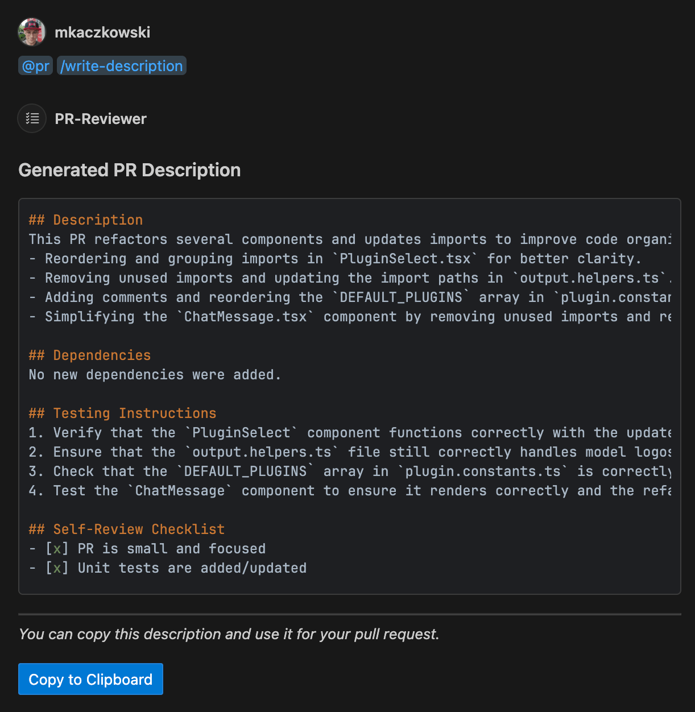
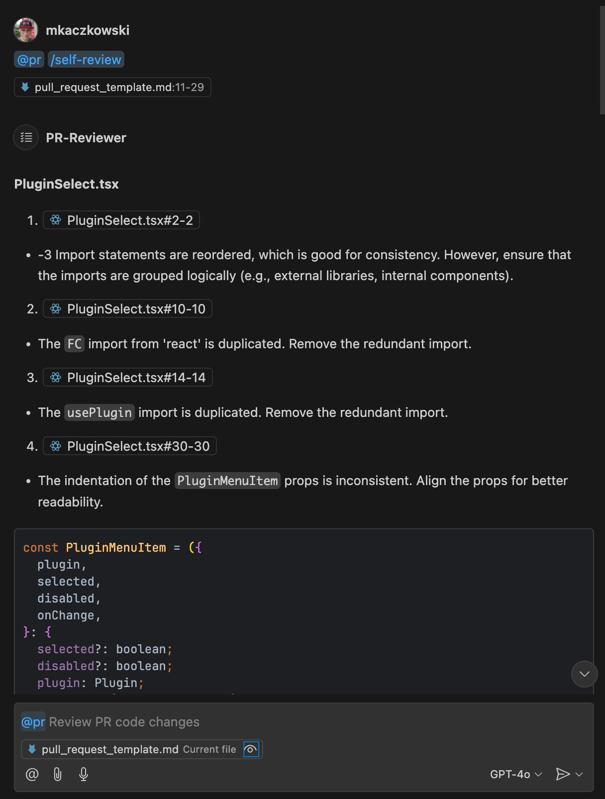

# Copilot Code Review

A VS Code extension that leverages GitHub Copilot to review your changes and suggest improvements. This extension helps you improve code quality by providing AI-powered code reviews directly in your editor.

## Features

- **Instant Code Reviews**: Get immediate feedback on your code without waiting for team reviews
- **Git-Based Analysis**: Automatically compares your local changes to the main branch of your repository
- **Language Agnostic**: Works with any programming language supported by GitHub Copilot
- **Customizable**: Tailor the review focus with custom prompts
- **Precise Navigation**: Jump directly to the specific code locations mentioned in reviews
- **Markdown Formatting**: Well-structured reviews with file sections and line references
- **Command Palette Integration**: Run commands directly from the VS Code Command Palette
- **Auto-Completion**: Get command suggestions as you type in the chat

## Installation

### Prerequisites

- Visual Studio Code 1.95.0 or higher
- GitHub Copilot extension must be installed and properly configured
- Git repository with a main branch (main or master)

### Install from VS Code Marketplace

1. Open VS Code
2. Go to Extensions (Ctrl+Shift+X / Cmd+Shift+X)
3. Search for "Copilot Code Review"
4. Click Install

## Usage

### Reviewing Code Changes

This extension works by comparing your local changes to the main branch of your Git repository:

1. Open a Git repository in VS Code
2. Make changes to your code
3. Use one of the following methods to run commands:

#### Using Chat

1. Open a Copilot Chat
2. Type `@pr` followed by a command:

   - `@pr /self-review` - to review your code changes
   - `@pr /write-description` - to generate a description for your changes

   Auto-completion will suggest available commands as you type.

#### Using Command Palette

1. Open the Command Palette (Ctrl+Shift+P / Cmd+Shift+P)
2. Type "Copilot Code Review" to see available commands:
   - "Copilot Code Review: Self-Review Code" - to review your code changes
   - "Copilot Code Review: Write PR Description" - to generate a description for your changes
   - "Copilot Code Review: Show Debug Logs" - to view the extension logs

## Extension Settings

This extension contributes the following settings:

- `copilotCodeReview.customPrompt`: Customize the prompt sent to Copilot for code review
- `copilotCodeReview.enableDebugLogging`: Enable debug logging for the extension (default: true)

## Known Issues

- This extension requires the official GitHub Copilot extension to be installed
- Performance may vary depending on the size and complexity of the code being reviewed
- Very large files or diffs may be truncated due to token limits
- The extension requires a Git repository with a main branch (main or master)

## Privacy and Security

This extension sends code to GitHub Copilot for analysis. Please review our [Security Policy](SECURITY.md) for more information about data handling and best practices.

## Contributing

Contributions are welcome! Please see our [Contributing Guidelines](CONTRIBUTING.md) for more information.

## License

This project is licensed under the MIT License - see the [LICENSE](LICENSE) file for details.

## Screenshots

_Example of a code review performed by the extension_

_Example of a generated PR description_

## Changelog

See the [CHANGELOG.md](CHANGELOG.md) for details about each release.
